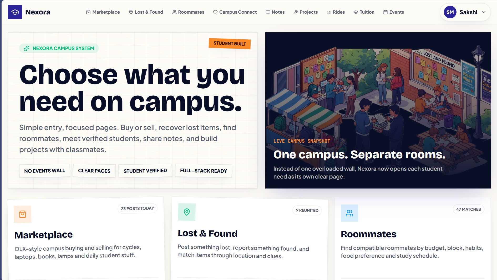
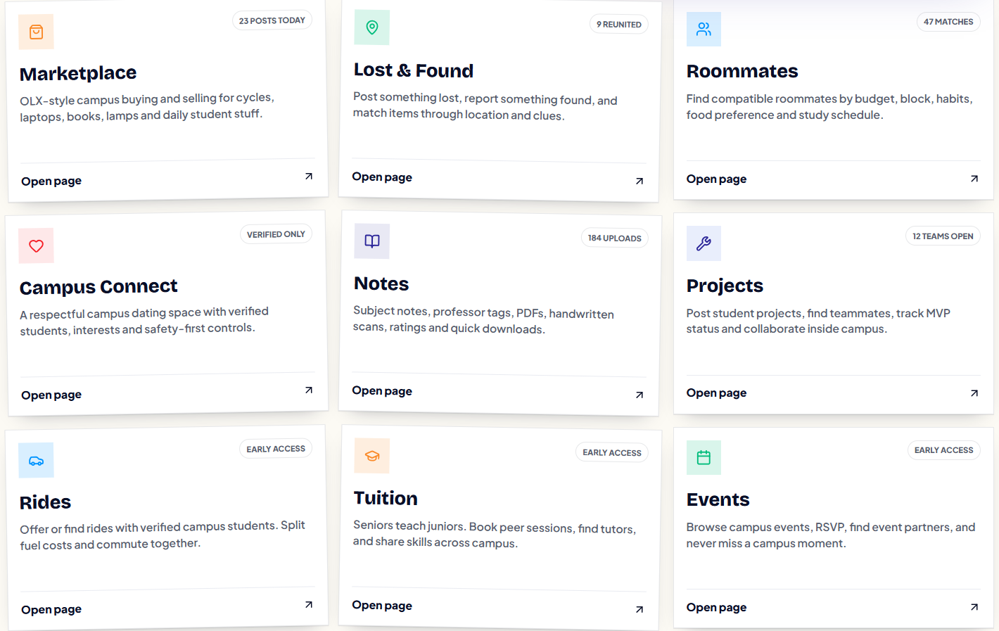

# Nexora - Comprehensive Campus Networking Platform


## 📌 Project Overview
Nexora is a cutting-edge campus networking platform built exclusively for university students. It consolidates fragmented campus interactions into a single, unified ecosystem featuring a robust marketplace, secure roommate matching, peer-to-peer lost & found, dating, event tracking, and ride-sharing.

This project is built with the modern React ecosystem, utilizing TanStack Start, React 19, Vite, Tailwind CSS v4, and Supabase for a fully typed, highly performant, and real-time experience.

---

## 📸 Landing Page



## 📊 Dashboard Preview



---

## 📑 Table of Contents
- [Project Overview](#-project-overview)
- [Problem Statement](#-problem-statement)
- [Vision](#-vision)
- [Key Features](#-key-features)
- [Tech Stack](#-tech-stack)
- [Architecture Overview](#️-architecture-overview)
- [Folder Structure](#-folder-structure)
- [Installation & Development Setup](#️-installation--development-setup)
- [Environment Variables](#-environment-variables)
- [Authentication & Security](#-authentication--security)
- [Database](#️-database)
- [Deployment](#-deployment)
- [Available Scripts](#-available-scripts)
- [Contributing](#-contributing)
- [Roadmap](#️-roadmap)
- [License](#-license)

---

## 🎯 Problem Statement
University students currently rely on fragmented, unsecured platforms (WhatsApp groups, generic Facebook pages, physical bulletin boards) for campus-specific needs. These channels suffer from:
- **Lack of Trust:** No verification of actual student status.
- **Noise:** Spam and irrelevant messages bury important listings.
- **Poor UX:** Hard to search for specific items, roommates, or lost goods.
- **Security Risks:** Scams are frequent due to anonymous actors.

## 🚀 Vision
Nexora aims to be the definitive "digital campus square." By requiring verifiable student status and restricting interactions to a local campus level, Nexora creates a high-trust, high-utility environment where students can securely trade, connect, and collaborate.

## ✨ Key Features
- **Student Marketplace:** Buy, sell, and trade textbooks, electronics, and dorm essentials with real-time chat and offer management.
- **Roommate Matching:** Find compatible roommates based on detailed lifestyle preferences, budget, and habits.
- **Lost & Found:** Quickly report and claim lost items with geolocation and photo evidence.
- **Real-time Chat:** Instant messaging powered by Supabase Realtime.
- **Role-Based Access Control:** Strict Row Level Security (RLS) ensuring users only see data relevant to their campus.

## 💻 Tech Stack
- **Frontend Framework:** React 19 with TanStack Start (SSR/SSG ready)
- **Routing:** TanStack Router (File-based, fully type-safe)
- **Data Fetching:** TanStack React Query
- **Styling:** Tailwind CSS v4, class-variance-authority, clsx, tailwind-merge
- **UI Components:** Radix UI primitives with shadcn/ui styling
- **Forms & Validation:** React Hook Form + Zod
- **Backend as a Service:** Supabase (PostgreSQL, GoTrue Auth, Realtime, Storage)
- **Build Tool:** Vite

---

## 🏗️ Architecture Overview
Nexora utilizes a modern full-stack architecture where the frontend (React/TanStack) communicates directly with a secure PostgreSQL database via Supabase's PostgREST API. 

For a deep dive into the architecture, component hierarchy, and data flow, please refer to the [Architecture Documentation](docs/ARCHITECTURE.md).

## 📁 Folder Structure
A detailed explanation of the project's directory layout and file relationships can be found in the [Folder Structure Documentation](docs/FOLDER_STRUCTURE.md).

---

## 🛠️ Installation & Development Setup

### Prerequisites
- Node.js (v18 or higher)
- npm or pnpm
- A Supabase account (for local or cloud database)

### Quick Start
1. **Clone the repository:**
   ```bash
   git clone https://github.com/your-org/nexora.git
   cd nexora
   ```
2. **Install dependencies:**
   ```bash
   npm install
   ```
3. **Start the development server:**
   ```bash
   npm run dev
   ```
4. **Open your browser:**
   Navigate to `http://localhost:5173`.

---

## 🔑 Environment Variables
Create a `.env` file in the root directory. You must supply your Supabase credentials:

```env
VITE_SUPABASE_URL=https://your-project-id.supabase.co
VITE_SUPABASE_ANON_KEY=your-anon-key
```
*For a complete list of environment variables, refer to [Environment Documentation](docs/ENVIRONMENT.md).*

---

## 🔒 Authentication & Security
Nexora uses **Supabase Auth (GoTrue)** for secure user management. We implement PostgreSQL Row Level Security (RLS) to guarantee that users can only interact with their own data or public data scoped to their specific campus.
- Read the [Authentication Documentation](docs/AUTHENTICATION.md)
- Read the [Security Documentation](docs/SECURITY.md)

---

## 🗄️ Database
Our PostgreSQL schema is optimized for speed, relational integrity, and secure multi-tenant access (per campus).
- Read the [Database Documentation](docs/DATABASE.md) to understand tables, relationships, and constraints.

---

## 🚀 Deployment
Nexora is designed for seamless deployment on platforms like Vercel or Netlify, while Supabase handles the database and auth layer.
- Follow the [Deployment Documentation](docs/DEPLOYMENT.md) for production checklists and CI/CD setup.

---

## 📜 Available Scripts
- `npm run dev`: Starts the Vite development server.
- `npm run build`: Builds the app for production.
- `npm run preview`: Locally previews the production build.
- `npm run lint`: Runs ESLint across the codebase.
- `npm run format`: Formats code using Prettier.

---

## 🤝 Contributing
We welcome contributions to Nexora! Whether it's fixing bugs, adding features, or improving documentation, please read our [Contributing Guidelines](docs/CONTRIBUTING.md) to get started.

## 🗺️ Roadmap
Curious about what's next? Check out our [Future Roadmap](docs/ROADMAP.md) to see planned features like AI-assisted roommate matching and advanced event discovery.

---

## 📄 License
This project is licensed under the MIT License. See the [LICENSE](LICENSE) file for details.

---
*Generated as part of Nexora's comprehensive documentation initiative.*
