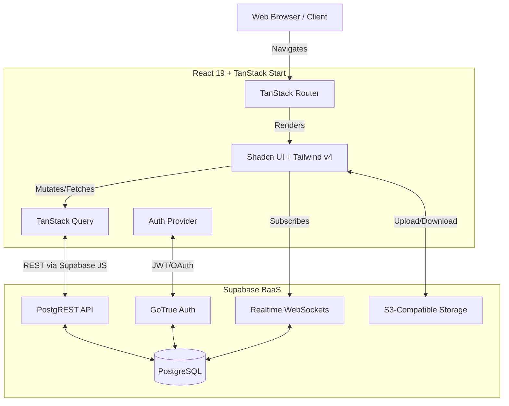
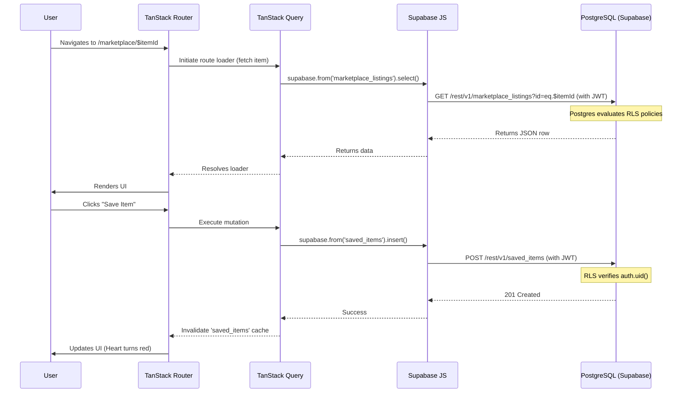

# System Architecture

Nexora utilizes a modern, serverless-first architecture designed for rapid iteration, high performance, and real-time capabilities. By leveraging the TanStack ecosystem and Supabase, the application minimizes boilerplate while maintaining strong type safety and scalability.

## High-Level Architecture

The system is conceptually divided into a thick, intelligent frontend client and a thin, secure Backend-as-a-Service (BaaS) layer.

---

## 1. Frontend Layer
The frontend is built using **React 19** and orchestrated by **TanStack Start**.

### Routing (`@tanstack/react-router`)
Nexora utilizes a file-based routing approach. 
- **Type Safety:** The router generates strict TypeScript types for all routes, search parameters, and loaders.
- **Data Loading:** Each route file (`.tsx`) exports a component and optionally integrates with TanStack Query for pre-fetching data before the UI renders, eliminating waterfall requests.
- **Protected Routes:** Route guards intercept navigation to ensure the user possesses a valid session before accessing private areas (e.g., `/marketplace`, `/dashboard`).

### State Management & Data Fetching (`@tanstack/react-query`)
Global state management is heavily minimized. Instead, server state is managed via React Query:
- **Caching:** API responses are cached and automatically invalidated when mutations occur.
- **Optimistic Updates:** UI interactions (like "saving" a marketplace item or sending a chat message) are updated optimistically for a snappy UX, with rollbacks in case of network failure.

### UI & Styling
- **Tailwind CSS v4:** Utility-first styling with zero configuration.
- **Radix UI & Shadcn:** Unstyled, accessible primitives wrapped in custom Tailwind configurations to maintain Nexora's brand identity.
- **Lucide React:** Consistent iconography across the platform.

---

## 2. Backend Layer (Supabase)
Instead of a traditional Node.js/Express backend, Nexora relies on Supabase.

### PostgreSQL & PostgREST
The core of the application is a PostgreSQL database. Supabase automatically generates a RESTful API (PostgREST) based on the database schema.
- **Direct DB Access:** The frontend queries the database directly using `@supabase/supabase-js`.
- **Security:** Since the client accesses the database directly, **Row Level Security (RLS)** is strictly enforced. RLS policies act as the primary authorization layer, ensuring a user can only query or mutate rows they are explicitly allowed to access (e.g., `user_id = auth.uid()`).

### Authentication (GoTrue)
Supabase handles user registration, login, and session management.
- **Flow:** Upon login, GoTrue issues a JWT. This JWT is automatically attached to subsequent PostgREST requests.
- **Postgres Integration:** The JWT contains the user's `uuid`. Postgres functions and RLS policies read this `uuid` via `auth.uid()` to determine data access rights.

### Realtime (WebSockets)
Supabase Realtime is utilized for instantaneous feature updates:
- **Chat Messages:** The marketplace and roommate matching systems use realtime subscriptions to listen for new `INSERT` events on the `messages` tables, updating the UI instantly without polling.
- **Notifications:** Push-like notifications for offers or visit requests.

---

## 3. Data Flow Example: Marketplace Listing

To illustrate the architecture, here is the data flow when a user views and interacts with a marketplace listing.

## 4. Design Decisions & Tradeoffs

### Why TanStack Start over Next.js?
**Decision:** We chose TanStack Start for its unparalleled type safety, excellent integration with TanStack Query, and lighter runtime footprint compared to Next.js App Router.
**Tradeoff:** The ecosystem around TanStack Start is newer. Solutions for specific edge cases (like complex streaming SSR setups) require more manual configuration than Vercel's tightly coupled Next.js ecosystem.

### Why Backend-as-a-Service (Supabase) over Custom Node.js?
**Decision:** A custom Node API would introduce significant boilerplate (controllers, ORM definitions, DTOs). Supabase allows us to iterate rapidly by interacting directly with the DB from the frontend.
**Tradeoff:** Business logic must be handled either in the frontend (which is less secure for complex operations) or via Postgres Functions/Triggers (which can be harder to test and debug than TypeScript code). 

### Why Tailwind v4?
**Decision:** Upgrading to v4 removes the need for `tailwind.config.js`, drastically improving build times and simplifying the developer experience.
**Tradeoff:** Community plugins and some older shadcn/ui components may require slight modifications to support v4's CSS variable-driven configuration.
