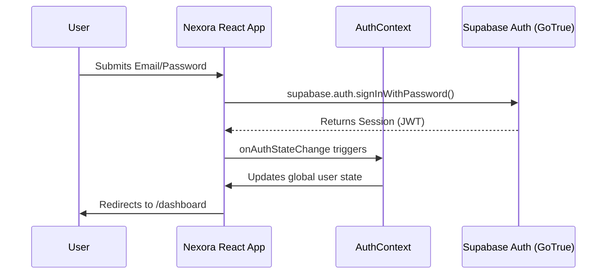

# Authentication

Nexora delegates all identity management and authentication to **Supabase Auth (GoTrue)**. This ensures enterprise-grade security without the overhead of maintaining custom password hashing or session management logic.

## Supported Methods
- **Email/Password:** Traditional login mechanism.
- **Magic Links / OTP:** (Supported by infrastructure, to be fully implemented in UI).
- **OAuth Providers:** Configurable via Supabase dashboard (Google, GitHub, etc.).

## The Auth Context (`src/contexts/AuthContext.tsx`)
The `AuthContext` is the heart of frontend authentication. 
1. **Initialization:** On initial load, it calls `supabase.auth.getSession()` to check for an existing session in local storage.
2. **Subscription:** It immediately subscribes to `supabase.auth.onAuthStateChange`. If a user logs in via another tab, or their session expires, the context automatically updates the entire React tree.
3. **Session State:** Exposes `session`, `user`, and a `signOut` method via the `useAuth()` hook.

## Protected Routes & Navigation Guards
Because Nexora uses TanStack Router, route protection happens at the routing layer before a component ever renders.

- The `__root.tsx` layout or specific route definitions inspect the `useAuth()` state.
- If a user attempts to access `/marketplace` without a valid session, the router intercepts the request and redirects them to `/auth/login`, appending the attempted URL to the search parameters (`?redirect=/marketplace`) so they can be sent back after logging in.

## JSON Web Tokens (JWT)
Supabase Auth relies on JWTs for session persistence.
- The JWT is stored securely by the `@supabase/supabase-js` client.
- Every time a component uses the Supabase client to fetch data (e.g., `supabase.from('profiles').select()`), the client automatically attaches the JWT in the `Authorization: Bearer` header.
- The PostgreSQL database decodes this JWT automatically. RLS policies can then access the user's ID via the `auth.uid()` function.

## Onboarding Flow
Authentication is intrinsically linked to our onboarding flow:
1. User signs up via `/auth/signup`.
2. Auth Context updates.
3. A routing guard detects that `isProfileComplete()` returns `false` (checking `src/lib/auth.ts`).
4. User is hard-redirected to `/complete-profile` to enter their Name and College before they are allowed to access the main dashboard.
