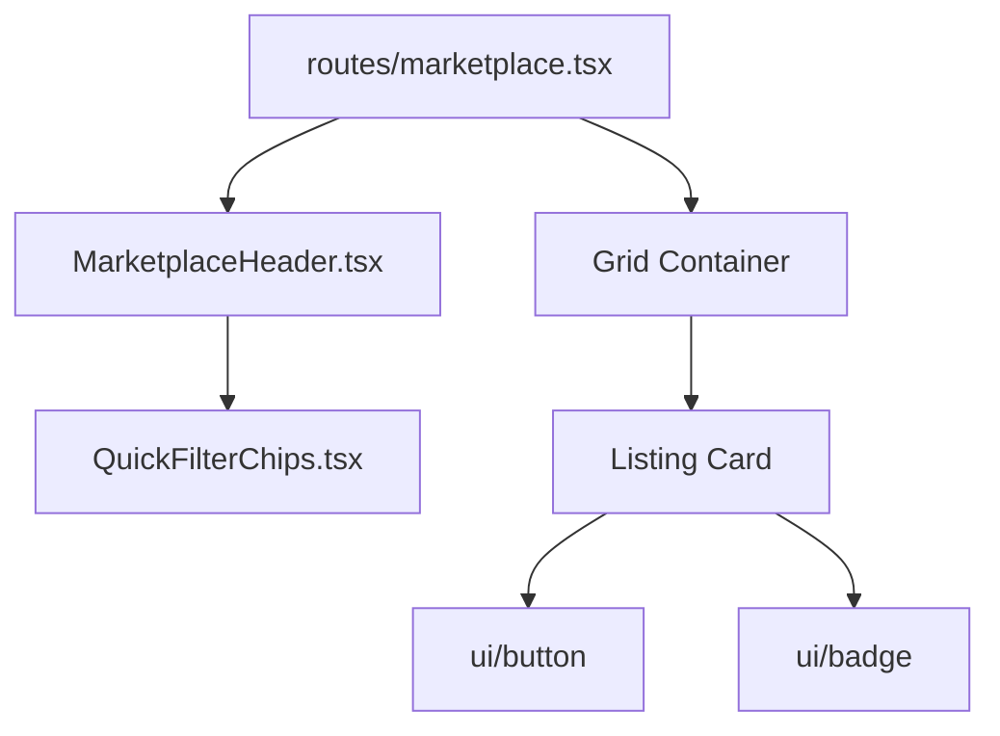

# Components Architecture

Nexora utilizes a highly modular React component architecture, heavily influenced by atomic design principles and the `shadcn/ui` methodology.

## 1. UI Primitives (`src/components/ui/`)
This folder contains the generic building blocks of the application. These components are completely devoid of business logic. They accept standard React props and Tailwind class overrides via the `cn()` utility.

**Examples:**
- `Button.tsx`: Utilizes `class-variance-authority` to define variants (e.g., `default`, `destructive`, `outline`, `ghost`, `link`) and sizes (`default`, `sm`, `lg`, `icon`).
- `Dialog.tsx`: Wraps `@radix-ui/react-dialog` to provide an accessible modal component with predefined Tailwind styling for overlays, content windows, headers, and footers.
- `Input.tsx`, `Textarea.tsx`, `Label.tsx`: Form primitives that share a consistent focus-ring and error-state visual language.

**Rules for `ui/` folder:**
- NEVER import business logic (e.g., `supabase` or `useAuth`) into these files.
- NEVER hardcode specific text or icons into these components unless passed via props or `children`.

---

## 2. Feature Components (`src/components/[feature]/`)
Feature components combine UI primitives with specific business logic to create complex, reusable sections of the application.

### Marketplace Components (`src/components/marketplace/`)

#### `SellerDashboard.tsx`
- **Purpose:** A complex layout for users to manage their active, draft, sold, and archived listings.
- **Props:** Receives `listings` array and action handlers (`onPostItem`, `onEditItem`, `onMarkSold`, etc.) from its parent route.
- **State:** Manages internal `activeTab` state (Published, Drafts, Sold, Archived) to filter the incoming `listings` array.
- **Child Components:** Utilizes `StatBox` for analytics and `EmptyState` for empty tabs. Uses standard UI components like `Button` and `DropdownMenu`.

#### `MarketplaceChat.tsx`
- **Purpose:** Handles real-time messaging between a buyer and seller regarding a specific item.
- **Props:** Receives `listingId`, `sellerId`, and `currentUser` details.
- **Hooks:** Uses Supabase Realtime subscriptions to listen for new messages inserted into the `messages` table.
- **State:** Maintains an optimistic UI array of `messages`.

#### `QuickFilterChips.tsx`
- **Purpose:** A horizontal scrollable list of categories to quickly filter the marketplace feed.
- **Performance:** Completely stateless visually; it accepts an `activeCategory` prop and an `onSelect` callback.

#### `ListingDetail.tsx`
- **Purpose:** Renders the full-screen detailed view of a product, including an image carousel, seller information, and CTAs (Message, Save).
- **Hooks:** Often wrapped by a parent that utilizes `useQuery` to fetch the specific listing data.

---

## 3. Component Hierarchy Example

Here is how the marketplace feed is composed:

## 4. Reusable Logic (Hooks)
To keep components clean, data-fetching and complex side-effects are extracted into custom hooks within `src/hooks/`.

- Components call hooks like `const { data: listings, isLoading } = useMarketplaceListings()`.
- The component is only responsible for rendering the UI based on `isLoading`, `error`, or `data` states.
