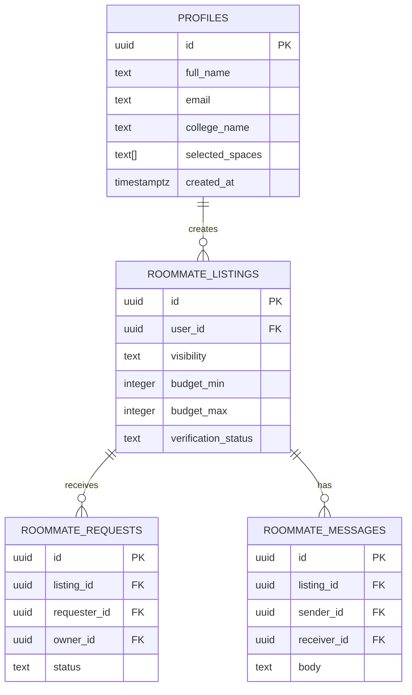

# Database Architecture

Nexora uses **PostgreSQL** hosted on **Supabase** as its primary data store. The database is highly relational and heavily relies on Row Level Security (RLS) to ensure multi-tenant data isolation at the user level.

---

## 1. Profiles (`public.profiles`)
The central table for user identity. It extends the built-in Supabase `auth.users` table.

- **Primary Key:** `id` (References `auth.users(id)` `ON DELETE CASCADE`)
- **Key Columns:**
  - `full_name` (text)
  - `email` (text)
  - `college_name` (text)
  - `selected_spaces` (text array) - Determines which modules (Marketplace, Roommates) the user has activated.
- **RLS Policies:**
  - *Select/Insert/Update:* Users can only read and mutate their own profile (`auth.uid() = id`).

## 2. Roommate Listings (`public.roommate_listings`)
Stores the user's roommate matching preferences and profile data.

- **Primary Key:** `id` (uuid)
- **Foreign Keys:** `user_id` -> `auth.users(id)`
- **Key Columns:**
  - `is_looking_enabled`, `is_listing_enabled` (booleans) - Toggles for active search.
  - `budget_min`, `budget_max` (integers)
  - `verification_status` (pending, verified, rejected)
  - Extensively typed preferences (`smoking`, `alcohol`, `visitors`, etc.)
- **RLS Policies:**
  - *Select:* Visible if `visibility` is 'public'/'campus_only' AND `paused` is false, OR if the requester is the owner.
  - *Insert/Update/Delete:* Restricted strictly to the `user_id` owner.

## 3. Roommate Requests (`public.roommate_requests`)
Manages connection requests between users for potential roommate arrangements.

- **Foreign Keys:** 
  - `listing_id` -> `roommate_listings(id)`
  - `requester_id` -> `auth.users(id)`
  - `owner_id` -> `auth.users(id)`
- **Key Columns:**
  - `status` (pending, accepted, declined, cancelled)
- **RLS Policies:**
  - *Select/Update:* Visible and mutable by *both* the `requester_id` and the `owner_id`.

## 4. Roommate Messages (`public.roommate_messages`)
Stores real-time chat messages between users who have connected.

- **Foreign Keys:** `sender_id`, `receiver_id` -> `auth.users(id)`
- **Key Columns:** `body` (text)
- **RLS Policies:**
  - *Select:* Visible to both sender and receiver.
  - *Insert:* User must be the `sender_id`.

---

## Marketplace Tables (Inferred)
*Note: The exact schema for marketplace tables (e.g., `marketplace_listings`, `saved_items`) is maintained in `supabase/migrations/` and operates on the same principles as the Roommate tables above, utilizing `auth.users` for foreign keys and strict RLS for isolation.*

## Future Improvements
- **Indexing:** Currently, basic Primary Keys are indexed. As search queries grow, we will need GIN indexes on arrays (`languages`, `interests`) and Text Search vectors for descriptions.
- **Partitioning:** The `messages` tables will eventually need partitioning by month as data volume grows to maintain query speed.
