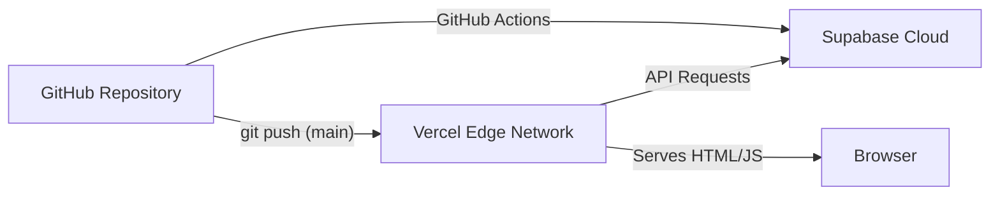

# Deployment Strategy

Nexora is designed to be deployed across two primary cloud providers: **Vercel** for the frontend hosting and **Supabase** for the backend/database.

## 1. Frontend Deployment (Vercel)

Vercel is the recommended hosting provider for TanStack Start applications due to its edge-caching and zero-config deployment.

### Steps to Deploy:
1. Connect your GitHub repository to Vercel.
2. Ensure the Framework Preset is set to **Vite**.
3. Set the Build Command to `npm run build` or `vite build`.
4. Set the Output Directory to `dist`.
5. Add the required Environment Variables (see below).

### Preview Deployments
Vercel automatically creates a unique Preview URL for every Pull Request. This allows the team to QA UI changes in a live environment before merging into `main`.

---

## 2. Backend Deployment (Supabase)

The database schema, RLS policies, and Auth configurations must be deployed to a production Supabase project.

### Database Migrations
We use the Supabase CLI to manage database changes.
1. Local development uses a local Dockerized Supabase instance (`supabase start`).
2. Changes are captured via `supabase db diff -f feature_name`.
3. Migrations are pushed to production via GitHub Actions or manual CLI push (`supabase db push`).

### Edge Functions (Future)
If we implement custom backend logic (e.g., Stripe payments, email triggers), they will be deployed as Deno-based Supabase Edge Functions.

---

## 3. Environment Variables

Both the local `.env` and Vercel Production Environment must contain:

| Variable | Description |
|----------|-------------|
| `VITE_SUPABASE_URL` | The URL of your Supabase project (e.g., `https://xyz.supabase.co`). |
| `VITE_SUPABASE_ANON_KEY` | The public anonymous key for PostgREST API access. |

*Warning: Never place the Supabase `SERVICE_ROLE_KEY` in Vercel's environment variables unless you are writing Server-Side code that explicitly requires bypassing RLS. It must NEVER be prefixed with `VITE_`.*

---

## 4. Custom Domain & SSL
1. Configure a custom domain (e.g., `nexora.app`) in the Vercel dashboard.
2. Vercel automatically provisions and renews SSL certificates via Let's Encrypt.
3. **Important:** Ensure the Supabase Auth configuration is updated so that `nexora.app` is an allowed Redirect URI for OAuth and Email verifications.

---

## 5. Rollback Strategy
- **Frontend:** Vercel allows instant rollbacks to any previous deployment with a single click in the dashboard.
- **Backend:** Database rollbacks are handled via Supabase CLI migrations. Data loss prevention relies on Point-in-Time Recovery (PITR) enabled in the Supabase Pro plan.
