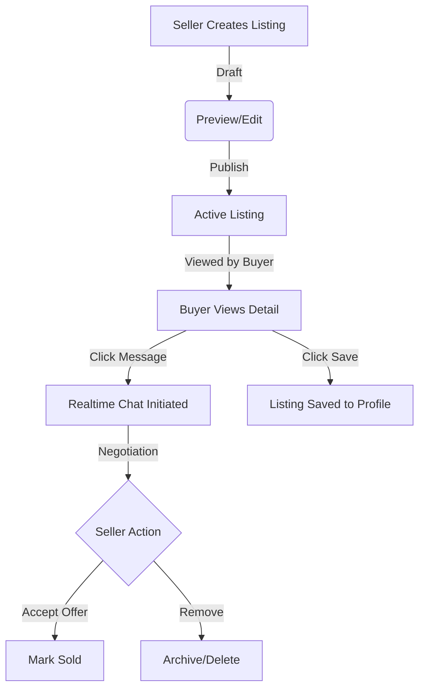
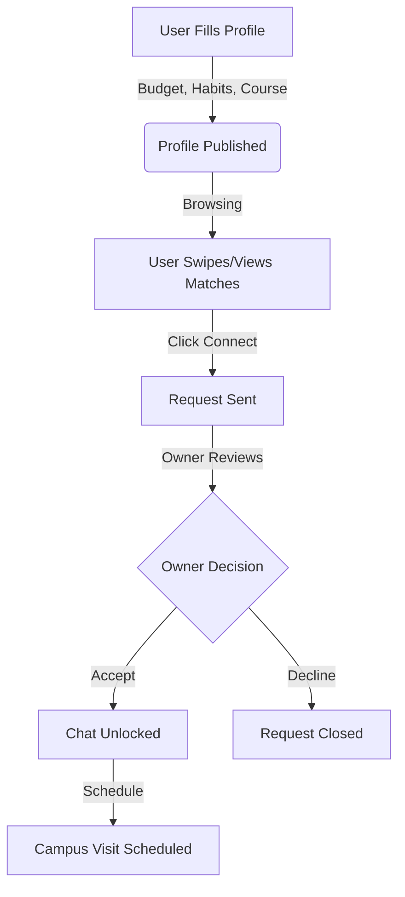

# Features Overview

Nexora is composed of multiple distinct "modules" tailored for campus life. Each feature is designed to be fully isolated at the database level using Row Level Security (RLS) while sharing a unified UI.

---

## 1. Campus Marketplace
The Marketplace allows students to buy, sell, and trade items locally within their campus network.

### Purpose
To provide a high-trust environment for exchanging textbooks, electronics, and dorm supplies without the spam and scams found on generic platforms.

### Core Workflow

### Database Entities
- `marketplace_listings`: Stores item details (title, price, category, condition).
- `saved_items`: Tracks which users have favorited which items.

### UI & Logic
- **Seller Dashboard:** A premium, Facebook-Marketplace-style dashboard allowing sellers to track Analytics (Views, Saves, Chats, Offers) and manage their inventory across Published, Drafts, Sold, and Archived tabs.
- **Image Uploads:** Handled via Supabase Storage buckets, allowing drag-and-drop uploads for product photos.

---

## 2. Roommate Matching
A deeply customizable engine for finding compatible roommates based on lifestyle, budget, and habits.

### Purpose
To eliminate the friction and uncertainty of finding a roommate on traditional housing groups.

### Core Workflow

### Database Entities
- `roommate_listings`: Stores hyper-specific preferences (smoking, sleep schedule, cleanliness).
- `roommate_requests`: Acts as the "friend request" gating mechanism.
- `roommate_visit_schedules`: Allows confirmed matches to schedule a real-life meeting.

### UI & Logic
- **Verification Status:** Profiles feature a Verification badge to build trust.
- **Privacy Controls:** Users can set their visibility to `public`, `campus_only`, or `hidden` (pausing their profile while retaining data).

---

## 3. Lost & Found
A peer-to-peer system for recovering lost items on campus.

### Purpose
To replace disorganized WhatsApp groups with a searchable, geolocated database of found items.

### Flow
1. User reports an item (Lost or Found) with a photo and approximate location.
2. The item is added to the campus-wide feed.
3. Users can filter by category (e.g., Electronics, Keys, IDs).
4. Claims are processed via direct messages to verify ownership before hand-off.

---

## Future Improvements (Cross-Feature)
- **AI Moderation:** Integrating an AI layer to automatically flag inappropriate images uploaded to the Marketplace or Roommate profiles.
- **Unified Notification Center:** A single global bell icon that aggregates Chat messages, Roommate requests, and Marketplace offers using Supabase Realtime.
